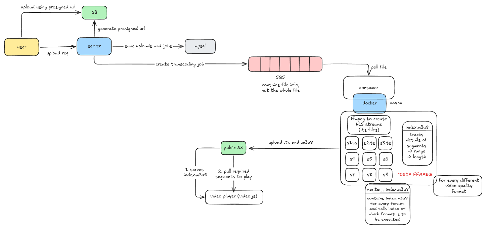
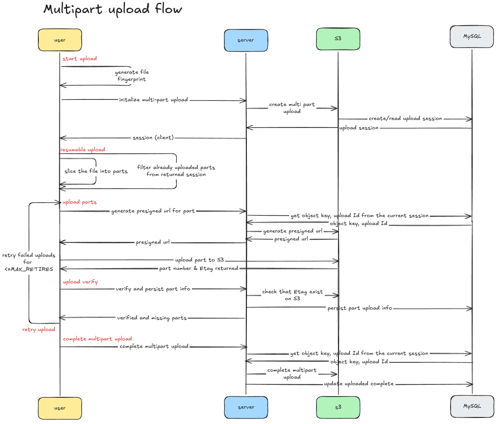

# Http Live Streaming Service with Transcoding using ffmpeg

## High level diagram  
  
---

## Upload sequence diagram    

## Running Frontend
- from the root folder `cd client`
- run `npm install` 
- run `npm run dev` (required nvm >= 22)  

## Running backend locally without docker  
- run these command in from the root folder `cd server`
- create .env (not .docker.env), see .example.env for reference  

#### Running MySQL and migrations  
- Make sure to first create a database in your local mysql environment  
- Run the migration `mysql -u root -p <dbName> < migrations/init.sql`

#### Running API server  
- run `go run cmd/api/main.go` or using air run `air -c .air.api.toml`

#### Running workers  
- run `go run cmd/worker/main.go` or using air run `air -c .air.worker.toml`
- do this for as many workers you want

## Running backend locally With Docker Compose
- run these command in from the root folder `cd server`  
- create .docker.env (not .env), see .example.env for reference  

#### Building using Docker compose
- run `docker compose up --build`
- this will:
  - Pull mysql:8.4
  - Build Dockerfile.api
  - Build Dockerfile.worker
  - Create the mysql_data volume
  - Start MySQL (also run the migration file)
  - Wait for MySQL healthcheck
  - Start API
  - Start Worker
- verify that the services are running using `docker compose ps` and `docker compose logs -f`  

## Others
#### Manually building Dockerfiles  
- pull mysql:8.4 image from docker hub  
- build Dockerfile.api using `docker build -f Dockerfile.api -t hls-api .`  
- build Dockerfile.worker using `docker build -f Dockerfile.worker -t hls-worker .`  

#### Manually running MySQL and migrations  
- first run `docker compose up -d mysql` seperately  
- make sure the sql container is healthy using `docker compose ps`, because api and worker are dependent on it  
- inside the container, run the migration command `docker exec -i hls-mysql mysql -u <user-name> -p<password> <dbName> < migrations/init.sql`  

#### Running API server  
- To start the api server run `docker compose up -d api`  

#### Running multiple workers  
- To start a single worker run `docker compose up -d worker` and to see its logs `docker logs <container name> -f`  
- To start another one, dont run the same command again it will just attach the terminal to the previous run container.  
- Instead use `docker compose up -d --scale worker=2`, now two different worker containers run, with their own seperate logging  

- similary, if want to run multiple workers at once run `docker compose up -d --scale worker=4`  

## Shutting down and removing volume
- To stop a running containter use `docker compose down <container name>`  
- To remove volume use `docker compose down mysql -v`  
- To stop all containers at once and remove volumne use `docker compose down -v`   